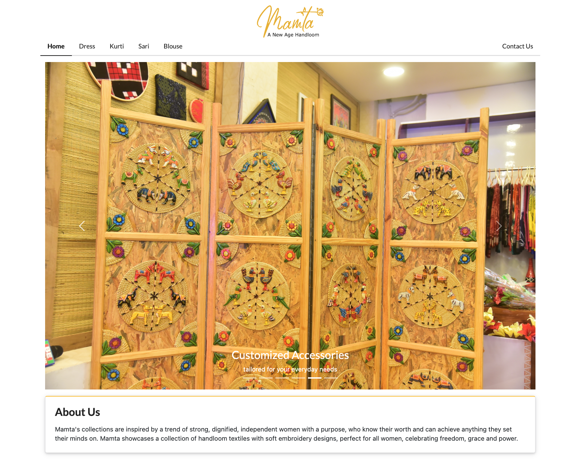

React app to build a women's clothing catalog.

## Tools Used

- react-js [[Ref]](https://reactjs.org/docs/getting-started.html)
- Unsplash API [[Ref]](https://unsplash.com/documentation#getting-started)
- Semantics UI (_for CSS_) [[Ref]](https://semantic-ui.com/introduction/getting-started.html)

## Running the project

In the project directory, you can run:

### `npm start`

Runs the app in the development mode. 
Open [http://localhost:3000](http://localhost:3000) to view it in the browser.

The page will reload if you make edits. 
You will also see any lint errors in the console.

## Usage

1. View products by clicking on the top menu bar
2. Returned products are displayed below
3. Click on any product to view details
